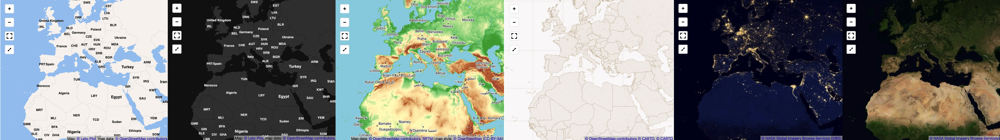

# Configuring basemap tiles for interactive maps

- [Configuring globally](#global-cfg)
- [Configuring for a single plot](#plot-cfg)
- [Vector tiles](#vector-tiles)
- [Blank tiles](#blank-tiles)
- [Raster tiles](#raster-tiles)
  - [OpenStreetMap](#osm-tiles)
  - [OpenTopoMap](#topo-tiles)
  - [Stamen Design](#stamen-tiles)
  - [CARTO](#carto-tiles)
  - [NASA's Global Imagery Browse Services (GIBS)](#nasa-tiles)

- [Examples](#examples)
- [Configuring raster tiles manually](#raster-tiles-man)


<a id="global-cfg"></a>
## Configuring globally

You can configure global Lets-Plot options using
the [LestPlot.set(`dictionary`)](https://lets-plot.org/pages/api/lets_plot.LetsPlot.html?highlight=set#lets_plot.LetsPlot.set)
method.

Where the `dictionary` can contain all sorts of Lets-Plot options, including basemap tiles configuration options.

Lets-Plot provides a variety of constantas and functions which make configuring of basemap tiles simple:

```python
from lets_plot import tilesets

LetsPlot.set(tilesets.LETS_PLOT_DARK)
```

<a id="global-cfg"></a>
## Configuring for a single plot

Use `tiles` parameter in the [geom_livemap()](https://lets-plot.org/pages/api/lets_plot.geom_livemap.html) function:

```python
from lets_plot import tilesets

ggplot() + geom_livemap(tiles=tilesets.LETS_PLOT_DARK)
```

<a id="vector-tiles"></a>
## Vector tiles

Lets-Plot provides its own vector basemap tiles available in three variants:

- color
- dark
- light

By default Lets-Plot uses its "color" tiles.

Configure Lets-Plot vector tiles (globally or on the per-plot basis) with the help of
the [LetsPlot.maptiles_lets_plot(...)](https://lets-plot.org/pages/api/lets_plot.maptiles_lets_plot.html)
function:

```python
ggplot() + geom_livemap(tiles=maptiles_lets_plot(theme='dark'))
```

or with the help of a constant defined in the `tilesets` module:

```python
from lets_plot import tilesets

ggplot() + geom_livemap(tiles=tilesets.LETS_PLOT_DARK)
```

<a id="blank-tiles"></a>
## Blank tiles

Blank tiles show no other graphics but a solid background color which you can choose (a HEX value is expected):

```python
ggplot() + geom_livemap(tiles=maptiles_solid(color='#C1C1C1'))
```
You can also use a constant defined in the `tilesets` module (white tiles):
```python
from lets_plot import tilesets

ggplot() + geom_livemap(tiles=tilesets.SOLID)
```

Blank tiles do not require an internet connection.

<a id="raster-tiles"></a>
## Raster tiles

With Lets-Plot you can use ZXY raster tiles provided by 3rd party maptile services.

Some services provide free of charge raster tilesets. The `tilesets` module in Lets-Plot contains many such tilesets
pre-cofigured.

Again, you can use these tilesets to configure Lets-Plot globally or on the per-plot basis:

```python
from lets_plot import tilesets

ggplot() + geom_livemap(tiles=tilesets.OSM)
```

**Important**: always read the providers **Terms of Service** before using this provider's tiles in your project.

<a id="osm-tiles"></a>
### OpenStreetMap

[© OpenStreetMap contributors](https://www.openstreetmap.org/copyright)

- `OSM`: OpenStreetMap's Standard tile layer.

<a id="topo-tiles"></a>
### OpenTopoMap

Map data: [© OpenStreetMap contributors](https://www.openstreetmap.org/copyright)
, [SRTM](http://viewfinderpanoramas.org/) | map
style: [© OpenTopoMap](https://opentopomap.org/) ([CC-BY-SA](https://creativecommons.org/licenses/by-sa/3.0/))

- `OPEN_TOPO_MAP`

<a id="stamen-tiles"></a>
### Stamen Design

_Toner and Terrain:_

Map tiles by [Stamen Design](http://stamen.com/), under [CC BY 3.0](http://creativecommons.org/licenses/by/3.0). Data
by [OpenStreetMap](http://openstreetmap.org/), under [ODbL](http://www.openstreetmap.org/copyright).

_Watercolor:_

Map tiles by [Stamen Design](http://stamen.com/), under [CC BY 3.0](http://creativecommons.org/licenses/by/3.0). Data
by [OpenStreetMap](http://openstreetmap.org/), under [CC BY SA](http://creativecommons.org/licenses/by-sa/3.0).

- `STAMEN_DESIGN_TONER`, `STAMEN_DESIGN_TONER_HIRES`: Toner
- `STAMEN_DESIGN_TONER_LIGHT`, `STAMEN_DESIGN_TONER_LIGHT_HIRES`: Toner Light
- `STAMEN_DESIGN_TERRAIN`, `STAMEN_DESIGN_TERRAIN_HIRES` : Terrain
- `STAMEN_DESIGN_WATERCOLOR` : Watercolor
- `STAMEN_DESIGN_TONER_LABELS`, `STAMEN_DESIGN_TONER_LABELS_HIRES`: Toner Labels

<a id="carto-tiles"></a>
### CARTO

[© OpenStreetMap contributors](https://www.openstreetmap.org/copyright) [© CARTO](https://carto.com/attributions#basemaps)
, [© CARTO](https://carto.com/attributions)

Free for none-commercial services only (see [Limitations](https://github.com/CartoDB/basemap-styles#1-web-raster-basemaps)
, [License](https://github.com/CartoDB/basemap-styles/blob/master/LICENSE.md)).

- `CARTO_POSITRON`, `CARTO_POSITRON_HIRES` : Positron
- `CARTO_POSITRON_NO_LABELS`, `CARTO_POSITRON_NO_LABELS_HIRES` : Positron (no labels)
- `CARTO_DARK_MATTER_NO_LABELS`, `CARTO_DARK_MATTER_NO_LABELS_HIRES` : Dark Matter (no labels)
- `CARTO_VOYAGER`, `CARTO_VOYAGER_HIRES` : Voyager
- `CARTO_FLAT_BLUE`, `CARTO_FLAT_BLUE_HIRES` : Flat Blue
- `CARTO_MIDNIGHT_COMMANDER`, `CARTO_MIDNIGHT_COMMANDER_HIRES` : Midnight commander
- `CARTO_ANTIQUE`, `CARTO_ANTIQUE_HIRES` : Antique


<a id="nasa-tiles"></a>
### NASA's Global Imagery Browse Services (GIBS)

Imagery provided by services from NASA's Global Imagery Browse Services ([GIBS](https://earthdata.nasa.gov/eosdis/science-system-description/eosdis-components/gibs)), 
part of NASA's Earth Observing System Data and Information System ([EOSDIS](https://earthdata.nasa.gov/)).

[NASA's Global Imagery Browse Services (GIBS)](https://earthdata.nasa.gov/eosdis/science-system-description/eosdis-components/gibs).

Global Imagery Browse Services (GIBS) - [API for Developers](https://wiki.earthdata.nasa.gov/display/GIBS/GIBS+API+for+Developers).

Global Imagery Browse Services (GIBS) API - [Generic XYZ Tile Access](https://wiki.earthdata.nasa.gov/display/GIBS/GIBS+API+for+Developers#GIBSAPIforDevelopers-GenericXYZTileAccess).

[GIBS Available Imagery Products](https://wiki.earthdata.nasa.gov/display/GIBS/GIBS+Available+Imagery+Products).

- `NASA_CITYLIGHTS_2012` : CityLights 2012
- `NASA_BLUEMARBLE_NEXTGENERATION` : BlueMarble NextGeneration
- `NASA_GREYSCALE_SHADED_RELIEF_30M` : Greyscale Shaded Relief (30m)
- `NASA_COLOR_SHADED_RELIEF_30M` : Color Shaded Relief (30m)
- `NASA_TERRA_TRUECOLOR` : Terra TrueColor

<a id="examples"></a>
## Examples


Check out [this notebook](https://www.kaggle.com/alshan/the-gallery-of-basemaps) to see examples of various tilesets.           


<a id="raster-tiles-man"></a>
## Configuring raster tiles manually

In addition to pre-configured tilesets you can configure and use almost any other raster tilesets provided in `ZXY` format.

You can do it with the help of the [LetsPlot.maptiles_zxy()](https://lets-plot.org/pages/api/lets_plot.maptiles_zxy.html) function.

The following code will configure 'Stamen Design - Toner Hybrid' tiles:
```python

settings = dict(
    url = "https://stamen-tiles.a.ssl.fastly.net/toner-hybrid/{z}/{x}/{y}@2x.png",
    attribution = 'Map tiles by <a href="http://stamen.com">Stamen Design</a>, under <a href="http://creativecommons.org/licenses/by/3.0">CC BY 3.0</a>. Data by <a href="http://openstreetmap.org">OpenStreetMap</a>, under <a href="http://www.openstreetmap.org/copyright">ODbL</a>.'
)

ggplot() + geom_livemap(tiles=maptiles_zxy(**settings))
```

**Raster tiles configuration options**:
- `url` : ZXY tiles URL , e.g. `"https://{s}.tile.com/{z}/{x}/{y}.png"`.

  Where {z}, {x}, {y} and {s} are placeholders for zoom, coordinates and subdomain. 
- `attribution` : An attribution or a copyright notice. 
- `min_zoom` : Minimal zoom limit.
- `max_zoom` : Maximal zoom limit.
- `subdomains` : A list of characters where each character is interpreted as a subdomain in the times URL.   
        
You can also provide other key-value pairs to include into the tile URL as parameters:
```python
 maptiles_zxy(url='http://maps.example.com/{z}/{x}/{y}.png?access_key={key}', key='MY_ACCESS_KEY')
```
