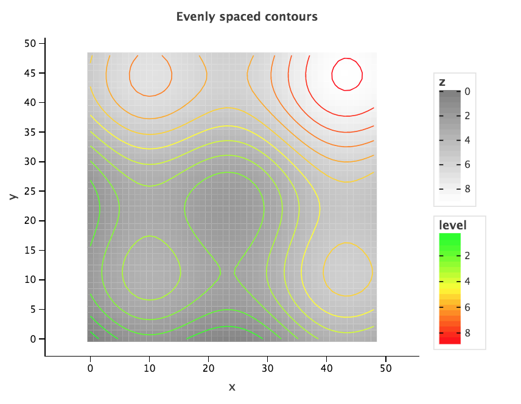
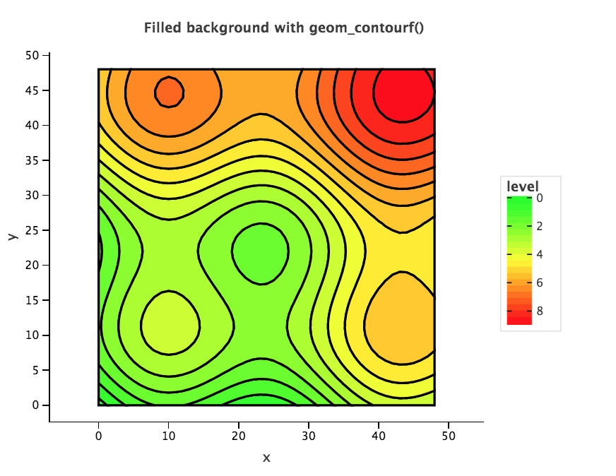
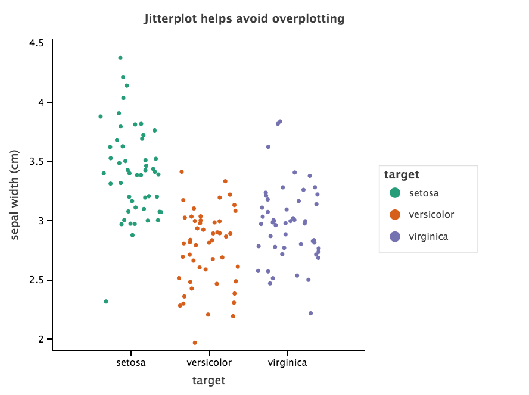
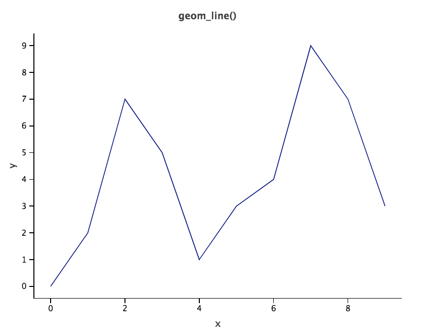
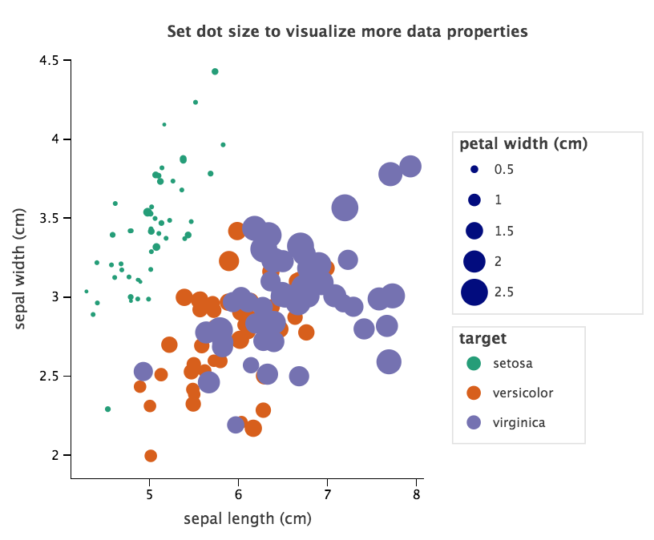
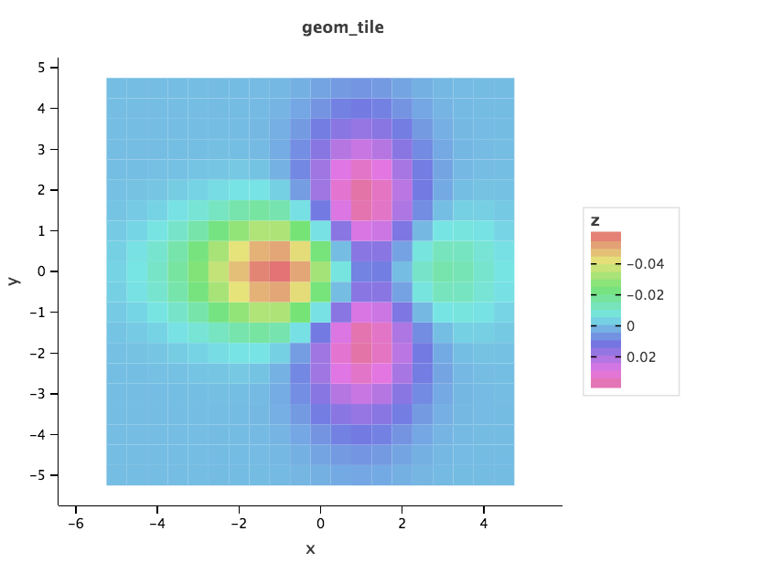
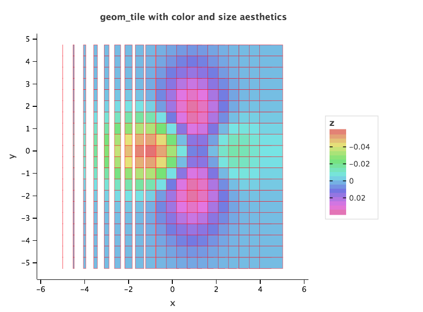
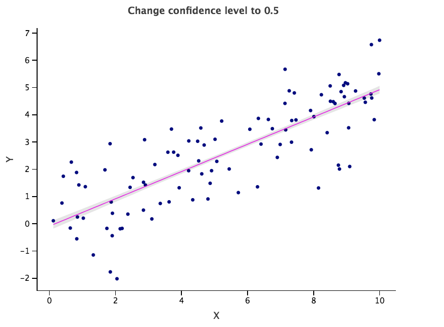

- geom_abline() geom_hline() geom_vline() | Reference lines: diagonal, horizontal and vertical
- geom_area() geom_ribbon() | Area plots and ribbons
- geom_bar() | Bar chart
- geom_boxplot() | Tukey-styled box-and-whiskers plot
- geom_contour(), geom_contourf() | 2d contours of a 3d surface
- geom_density() | Smoothed density estimates
- geom_density2d(), geom_density2df() | Contours of a 2d density estimate
- geom_errorbar() | Error bars
- geom_freqpoly(), geom_histogram() | Frequency polygons and histograms
- !!geom_image() | Insert image directly into the plot

- `geom_jitter()` | Jittered points
- **`!!geom_livemap` | TBC**
- `geom_path(), geom_line(), geom_step()`| Connect data points
- `geom_point()` | Points
- `geom_polygon()` | Polygons
- `geom_raster(), geom_tile()`, `geom_rect()` | Rectangles
- `geom_smooth()` | Smoothed conditional poligons
- `geom_segment()` | 	Line segments
- `geom_text()` | Add text


### geom_abline() geom_vline() geom_hline()

Straight lines to a plot specified by slope and intercept:

`geom_abline(mapping=None, data=None, stat=None, position=None, show_legend=None, sampling=None, slope=None, intercept=None, **other_args)`

Straight horizontal line:

`geom_hline(mapping=None, data=None, stat=None, position=None, show_legend=None, sampling=None, yintercept=None, **other_args)`

Straight vertical line:

`geom_vline(mapping=None, data=None, stat=None, position=None, show_legend=None, sampling=None, xintercept=None, **other_args)`

##### Arguments

- `mapping`: set of aesthetic mappings created by `aes()`. Aesthetic mappings describe the way that variables in the data are
        mapped to plot aesthetics.
- `data` (dictionary or pandas DataFrame, optional): The data to be displayed in this layer. If `None` (the default), the data
        is inherited from the plot data as specified in the call to ggplot.
- `stat`: (string, optional): The statistical transformation to use on the data for this layer, as a string. Supported transformations:
        `identity` (leaves the data unchanged), `count` (counts number of points with same x-axis coordinate),
        `bin` (counts number of points with x-axis coordinate in the same bin), `smooth` (performs smoothing -
        linear default)
- `position` (string, optional): Position adjustment, either as a string (`identity`, `stack`, `dodge`, ...), or the result of a call to a
        position adjustment function.
- `show_legend` (bool, optional): Controls this layer inclusion in the legends. `None`, the default - include if any aesthetics are mapped. 
        False - never include.
- `sampling` (optional): Sampling transformation - the result of call to a sampling function (`sampling_random()` etc.).        

`geom_abline`: 
- `slope`: The line slope.
- `intercept` The value of y at the point where the line crosses the y axis.

`geom_hline`:
- `yintercept`: The value of y at the point where the line crosses the y axis.

`geom_vline`:
- `xintercept`: The value of x at the point where the line crosses the x axis.

- `other_args` Other arguments passed on to the layer. Usually the aesthetics settings, like `color="red"`, `fill="blue"`, `size=3` or `shape=21`. Or the parameters to the
                     geom/stat pair.    

##### Aesthetics

`geom_abline()`: slope, intercept, alpha, colour, linetype, size

`geom_hline()`: yintercept, alpha, colour, linetype, size

`geom_vline()`: xintercept, alpha, colour, linetype, size

##### Examples

`ggplot()`

`+ geom_abline(intercept=1, slope=3, color='red', linetype='dashed', size=3, alpha=0.5)`

`+ geom_hline(yintercept=1, color='green', linetype='dashed', size=3, alpha=0.5)`

`+ geom_vline(xintercept=1, color='blue', linetype='dashed', size=3, alpha=0.5)`


### geom_area() geom_ribbon()

`geom_area(mapping=None, data=None, stat=None, position=None, other_args)`
`geom_ribbon(mapping=None, data=None, stat=None, position=None, other_args)`


##### Arguments

- `mapping`: set of aesthetic mappings created by `aes()`. Aesthetic mappings describe the way that variables in the data are
        mapped to plot aesthetics.
- `data` (dictionary or pandas DataFrame, optional): The data to be displayed in this layer. If `None` (the default), the data
        is inherited from the plot data as specified in the call to ggplot.
- `stat`: (string, optional): The statistical transformation to use on the data for this layer, as a string. Supported transformations:
        `identity` (leaves the data unchanged), `count` (counts number of points with same x-axis coordinate),
        `bin` (counts number of points with x-axis coordinate in the same bin), `smooth` (performs smoothing -
        linear default)
- `position` (string, optional): Position adjustment, either as a string (`identity`, `stack`, `dodge`, ...), or the result of a call to a
        position adjustment function.
- `other_args` Other arguments passed on to the layer. Usually the aesthetics settings, like `color="red"`, `fill="blue"`, `size=3` or `shape=21`. Or the parameters to the
                     geom/stat pair.    
                     
##### Aesthetics
`geom_area()`: x, y, alpha, colour, fill, linetype, size, group
`geom_ribbon()`: x, ymin, ymax, alpha, colour, fill, linetype, size, group
                     
##### Examples

`p = ggplot(dat, aes(x, y)) +  geom_line(aes(y = level))
p += geom_ribbon(aes(ymin = level - 1, ymax = level + 1), fill = "grey")
p`

`p = ggplot(dat, aes(x, y)) +  geom_line()
p += geom_area(aes(y = level))
p`

### geom_bar() | Bar chart

Plain bar chart. Bar charts represent either counts of cases for each group (default option) or values of a column in the dataset (`stat='identity'`)

`geom_bar(mapping = None, data = None, stat = "count",
   position = "stack", other_args)`

Default statistics - `count`
Default positioning - `stack`

##### Arguments

- `mapping`: set of aesthetic mappings created by `aes()`. Aesthetic mappings describe the way that variables in the data are
        mapped to plot aesthetics.
- `data` (dictionary or pandas DataFrame, optional): The data to be displayed in this layer. If `None` (the default), the data
        is inherited from the plot data as specified in the call to ggplot.
- `stat`: (string, optional): The statistical transformation to use on the data for this layer, as a string. Supported transformations:
        `identity` (leaves the data unchanged), `count` (counts number of points with same x-axis coordinate),
        `bin` (counts number of points with x-axis coordinate in the same bin), `smooth` (performs smoothing -
        linear default)
- `position` (string, optional): Position adjustment, either as a string (`identity`, `stack`, `dodge`, ...), or the result of a call to a
        position adjustment function.
- `other_args` Other arguments passed on to the layer. Usually the aesthetics settings, like `color="red"`, `fill="blue"`, `size=3` or `shape=21`. Or the parameters to the
                     geom/stat pair.
        
##### Aesthetics 
x, y, alpha, colour, fill, linetype, size

##### Examples

`dat = {}
 dat['number'] = ['one', 'two', 'three', 'two', 'three', 'three']`

`p = ggplot(dat, aes('number'))
 p += geom_bar()`
 

 
`dat['number'] = ['one', 'two', 'three', 'one', 'two', 'three']
 dat['value'] = [5, 1, 4, 5, 1, 1]`
  
`p += geom_bar(aes(weight='value'))`
 

 
 `p = ggplot(dat, aes('number', 'value', fill='subgroup'))
  p += geom_bar(stat='identity', position = position_dodge())`
  


### geom_boxplot()

`geom_boxplot(mapping=None, data=None, stat="identity", position="dodge", show_legend=None,
                 outlier_color=None, outlier_fill=None, outlier_shape=None, outlier_size=None,
                 varwidth=None, **other_args)`
                 
Default statistics - `identity`
Default positioning - `dodge`

##### Arguments

- `mapping`: set of aesthetic mappings created by `aes()`. Aesthetic mappings describe the way that variables in the data are
        mapped to plot aesthetics.
- `data` (dictionary or pandas DataFrame, optional): The data to be displayed in this layer. If `None` (the default), the data
        is inherited from the plot data as specified in the call to ggplot.
- `stat`: (string, optional): The statistical transformation to use on the data for this layer, as a string. Supported transformations:
        `identity` (leaves the data unchanged), `count` (counts number of points with same x-axis coordinate),
        `bin` (counts number of points with x-axis coordinate in the same bin), `smooth` (performs smoothing -
        linear default)
- `position` (string, optional): Position adjustment, either as a string (`identity`, `stack`, `dodge`, ...), or the result of a call to a
        position adjustment function.
- `outlier_color`, `outlier_fill`, `outlier_shape`, `outlier_size`:
        Default aesthetics for outliers.
- `varwidth`: if `FALSE` (default) make a standard box plot. If `TRUE`, boxes are drawn with widths proportional to the square-roots of the number of
        observations in the groups.
- `other_args` Other arguments passed on to the layer. Usually the aesthetics settings, like `color="red"`, `fill="blue"`, `size=3` or `shape=21`. Or the parameters to the
                     geom/stat pair.

##### Aesthetics
x, ymin, ymax, lower, middle, upper, alpha, colour, fill, size, weight, width

##### !Examples

`p = ggplot(mpg, aes('class', 'hwy', group='cyl', color='cyl'))
 p += geom_boxplot()`

### geom_contour(), geom_contourf()

2d contours of a 3d surface.

`geom_contour(mapping=None, data=None, stat="contour", position="identity", show_legend=None, bins=None, binwidth=None, other_args)`

Default statistics - `contour`
Default positioning - `identity`

##### Computed variables
- `..level..` - height of contour
- `..nlevel..` - height of contour, scaled to maximum of 1

##### Arguments

Instead of lineedn..., use `bins` or `binwidth` to set 

- `mapping`: set of aesthetic mappings created by `aes()`. Aesthetic mappings describe the way that variables in the data are
        mapped to plot aesthetics.
- `data` (dictionary or pandas DataFrame, optional): The data to be displayed in this layer. If `None` (the default), the data
        is inherited from the plot data as specified in the call to ggplot.
- `stat`: (string, optional): The statistical transformation to use on the data for this layer, as a string. Supported transformations:
        `identity` (leaves the data unchanged), `count` (counts number of points with same x-axis coordinate),
        `bin` (counts number of points with x-axis coordinate in the same bin), `smooth` (performs smoothing -
        linear default)
- `position` (string, optional): Position adjustment, either as a string (`identity`, `stack`, `dodge`, ...), or the result of a call to a
        position adjustment function.
- `bins` (int, optional): Number of levels.
- `binwidth` (double, optional): Distance between levels.
- `other_args` Other arguments passed on to the layer. Usually the aesthetics settings, like `color="red"`, `fill="blue"`, `size=3` or `shape=21`. Or the parameters to the
                     geom/stat pair.

##### Aesthetics
x, y, alpha, colour, linetype, size, group
        
For `geom_contourf()`: 
`fill ` controls the color of a geometry areas. Can be continuous or discrete. For continuous value this will be a color gradient between two colors.

##### Examples

``

`p = ggplot(dat, aes('x', 'y'))
 p += geom_tile(aes(fill='z'))
 p += scale_fill_grey(start=50, end=100)
 p += scale_color_gradient('green', 'red')
 p + geom_contour(aes(z='z', color='..level..'))`
 

 
`p + geom_contour(aes(z='z', color='..level..'), bins=30)`



`p = ggplot(dat, aes('x', 'y'))
 p + geom_contourf(aes(z='z', fill='..level..'), bins=15, color='black', size=1)\
          + scale_fill_gradient('green', 'red')`
          


### geom_density()

Visualises the data distribution over a continuous interval. Density plot is a smoothed version of a histogram.

`geom_density(mapping=None, data=None, stat="density", position="identity", show_legend=None, kernel=None, adjust=None, bw=None, n=None,
                               other_args)`

Default statistics - `density`
Default positioning - `identity`

##### Arguments
- `mapping`: set of aesthetic mappings created by `aes()`. Aesthetic mappings describe the way that variables in the data are
        mapped to plot aesthetics.
- `data` (dictionary or pandas DataFrame, optional): The data to be displayed in this layer. If `None` (the default), the data
        is inherited from the plot data as specified in the call to ggplot.
- `stat`: (string, optional): The statistical transformation to use on the data for this layer, as a string. Supported transformations:
        `identity` (leaves the data unchanged), `count` (counts number of points with same x-axis coordinate),
        `bin` (counts number of points with x-axis coordinate in the same bin), `smooth` (performs smoothing -
        linear default)
- `position` (string, optional): Position adjustment, either as a string (`identity`, `stack`, `dodge`, ...), or the result of a call to a
        position adjustment function.
- `kernel` : string, optional
        The kernel we use to calculate the density function. Choose among "gaussian", "cosine", "optcosine",
        "rectangular" (or "uniform"), "triangular", "biweight" (or "quartic"), "epanechikov" (or "parabolic")
- `bw`: string or double, optional
        The method (or exact value) of bandwidth. Either a string (choose among "nrd0" and "nrd"), or a double.
- `adjust`: double, optional
        Adjust the value of bandwidth my multiplying it. Changes how smooth the frequency curve is.
- `n`: int, optional
        The number of sampled points for plotting the function
- `other_args` Other arguments passed on to the layer. Usually the aesthetics settings, like `color="red"`, `fill="blue"`, `size=3` or `shape=21`. Or the parameters to the
                     geom/stat pair.
  
##### Aesthetics
x, y, alpha, colour, fill, linetype, size, group

##### Examples

`p = ggplot(dat, aes(x, y)) 
 p += geom_density() `
 

 
 `p = ggplot(dat, aes(x, y, color='target')) 
 p += geom_density()`
 

 
`p += scale_alpha([0.1, 1])` 
 


### geom_density2d(), geom_density2df()

Display density function contour. `geom_density2df()` fills the density function contour.

`geom_density2d(mapping=None, data=None, stat="identity", position="identity", show_legend=None,
                    kernel=None, adjust=None, bw=None, n=None,
                    bins=None, binwidth=None, other_args)`

Default statistics - `identity`
Default positioning - `identity`

##### Arguments

- `mapping`: set of aesthetic mappings created by `aes()`. Aesthetic mappings describe the way that variables in the data are
        mapped to plot aesthetics.
- `data` (dictionary or pandas DataFrame, optional): The data to be displayed in this layer. If `None` (the default), the data
        is inherited from the plot data as specified in the call to ggplot.
- `stat`: (string, optional): The statistical transformation to use on the data for this layer, as a string. Supported transformations:
        `identity` (leaves the data unchanged), `count` (counts number of points with same x-axis coordinate),
        `bin` (counts number of points with x-axis coordinate in the same bin), `smooth` (performs smoothing -
        linear default)
- `position` (string, optional): Position adjustment, either as a string (`identity`, `stack`, `dodge`, ...), or the result of a call to a
        position adjustment function.
- `kernel` : string, optional
        The kernel we use to calculate the density function. Choose among "gaussian", "cosine", "optcosine",
        "rectangular" (or "uniform"), "triangular", "biweight" (or "quartic"), "epanechikov" (or "parabolic")
- `bw`: string or double array, optional
        The method (or exact value) of bandwidth. Either a string (choose among "nrd0" and "nrd"), or a double array of length 2.
- `adjust`: double, optional
        Adjust the value of bandwidth my multiplying it. Changes how smooth the frequency curve is.
- `n`: int array, optional
        The number of sampled points for plotting the function (on x and y direction correspondingly)
- `bins` : int, optional
        Number of levels.
- `binwidth`: double, optional
        Distance between levels.
- `other_args` Other arguments passed on to the layer. Usually the aesthetics settings, like `color="red"`, `fill="blue"`, `size=3` or `shape=21`. Or the parameters to the
                     geom/stat pair.

##### Aesthetics
x, y, alpha, colour, linetype, size
        
For `geom_density2df()`: `fill` aesthetic parameter controls the color of geometry filling

##### Examples

`p + geom_density2d(aes('x', 'y', color='..level..')) + scale_color_hue()`


`p + geom_density2df(aes('x', 'y', fill='..level..')) + scale_fill_hue()`


`p + geom_density2df(aes('x', 'y', fill='..level..'), bins=200, sampling=sampling_group_random(100)+sampling_random(150000)) + scale_fill_hue()`


### geom_errorbar()

`geom_errorbar(mapping=None, data=None, stat="identity", position="identity", other_args)`

Default statistic - `identity`
Default position adjustment - `identity`

##### Arguments

- `mapping`: set of aesthetic mappings created by `aes()`. Aesthetic mappings describe the way that variables in the data are
        mapped to plot aesthetics.
- `data` (dictionary or pandas DataFrame, optional): The data to be displayed in this layer. If `None` (the default), the data
        is inherited from the plot data as specified in the call to ggplot.
- `stat`: (string, optional): The statistical transformation to use on the data for this layer, as a string. Supported transformations:
        `identity` (leaves the data unchanged), `count` (counts number of points with same x-axis coordinate),
        `bin` (counts number of points with x-axis coordinate in the same bin), `smooth` (performs smoothing -
        linear default)
- `position` (string, optional): Position adjustment, either as a string (`identity`, `stack`, `dodge`, ...), or the result of a call to a
        position adjustment function.
- `other_args` Other arguments passed on to the layer. Usually the aesthetics settings, like `color="red"`, `fill="blue"`, `size=3` or `shape=21`. Or the parameters to the
                     geom/stat pair.
                     
##### Aesthetics
x, ymin, ymax, alpha, colour, linetype, size, width, group                     

##### Examples

```python
 dat = {}
 dat['trt'] = [1, 1, 2, 2]
 dat['resp'] = [1, 5, 3, 4]
 dat['group'] = ['1', '2', '1', '2']
 dat['upper'] = [1.1, 5.3, 3.3, 4.2]
 dat['lower'] = [0.8, 4.6, 2.4, 3.6]
```
 
```python
 p = ggplot(dat, aes(x='trt', y='resp', color='group'))
 p += geom_errorbar(aes(ymin = 'lower', ymax = 'upper'), width = 0.3)
```


```python
 p = ggplot(dat, aes(x='trt', y='resp', fill='group', group='group'))
 p += geom_bar(position='dodge', stat='identity', width=0.3)
 p += geom_errorbar(aes(ymin='lower', ymax='upper'), width=0.3, position='dodge', color='black', size=0.9)
 p
```


### geom_freqpoly(), geom_histogram()

- arguments - binwidth, center, boundary

Plot the distribution of a single continuous variable. Each bin on the X-axis is the count of the number of observations.
Histograms (`geom_histogram()`) display the counts with bars; frequency polygons (`geom_freqpoly()`) display the counts with lines.

`geom_histogram(mapping=None, data=None, stat=None, position=None, bins=30, other_args)`

`geom_freqpoly(mapping=None, data=None, stat=None, position=None, other_args)`

##### Computed variables (if 'bin' stat)
- `..count..` - number of points in bin
- `..density..` - density of points in bin, scaled to integrate to 1

##### Arguments

 - `mapping`: set of aesthetic mappings created by `aes()`. Aesthetic mappings describe the way that variables in the data are
         mapped to plot aesthetics.
 - `data` (dictionary or pandas DataFrame, optional): The data to be displayed in this layer. If `None` (the default), the data
         is inherited from the plot data as specified in the call to ggplot.
 - `stat`: (string, optional): The statistical transformation to use on the data for this layer, as a string. Supported transformations:
         `identity` (leaves the data unchanged), `count` (counts number of points with same x-axis coordinate),
         `bin` (counts number of points with x-axis coordinate in the same bin), `smooth` (performs smoothing -
         linear default)
 - `position` (string, optional): Position adjustment, either as a string (`identity`, `stack`, `dodge`, ...), or the result of a call to a
         position adjustment function.
 - `width`: The width of the bins. The default is to use bin widths that cover the range of the data. 
            The bin width of a date variable is the number of days in each time; the bin width of a time variable is the
            number of seconds.
- `bins`: Number of bins. Overridden by width. Defaults to 30
- `other_args` Other arguments passed on to the layer. Usually the aesthetics settings, like `color="red"`, `fill="blue"`, `size=3` or `shape=21`. Or the parameters to the
                     geom/stat pair.

##### Aesthetics
`geom_histogram()`: x, y, alpha, colour, fill, size, weight, group
`geom_freqpoly()`:  x, y, alpha, colour, linetype, size, group

##### Examples

`p = ggplot(dat, aes('x'))
p += geom_histogram()`


`p = ggplot(dat, aes('x'))
p += geom_histogram(aes(y='..density..'), bins=10)`


```
 x_a = np.random.normal(0, 1, 200)
 y_a = np.random.normal(0, 1, 200)
 cat_a = ['A' for x in range(200)]
```
```
 x_b = np.random.normal(0, 1, 200)
 y_b = np.random.normal(0, 1, 200)
 cat_b = ['B' for x in range(200)]
```
```
 dat = {}
 dat['x'] = np.concatenate((x_a, x_b))
 dat['y'] = np.concatenate((y_a, y_b))
 dat['cat'] = np.concatenate((cat_a, cat_b))
```
`p = ggplot(dat, aes('x', fill='cat'))
 p + geom_histogram(alpha=0.5, position='identity')`


 

### geom_image()

Displays image specified by ndarray with shape (n, m), (n, m, 3), or (n, m, 4).
    This geom in not as flexible as `geom_raster()` or `geom_tile()` but vastly superior in the terms of
    rendering efficiency.
    
`geom_image(image_data, norm=None, vmin=None, vmax=None)`

##### Arguments

- `image_data` : ndarray with shape (n, m) or (n, m, 3) or (n, m, 4)
        Specifies image type, size and pixel values.
- `norm` (bool): False - disables default scaling of a 2-D float (luminance) input to the (0, 1) range.
- `vmin`, `vmax` (scalar, optional):The default is None. Used normalize luminance data. Only applied to gray-scale images encoded as float array.

##### Examples

`+ image from pictures`

`p = ggplot() + ggsize(600, 300)
 p += geom_image(image_data=img)`

### `geom_jitter()`
Jitterplot is a convenient shortcut for geom_point(`position="jitter"`). It helps to avoid having too many datapoints overshadowing each other (otherwise known as overplotting)

`geom_jitter(mapping=None, data=None, stat="identity", position="jitter", width=None, height=None, other_args)` 
 
Default statistics - `identity`
Default positioning - `jitter` 
 
###### Arguments
- `mapping`: set of aesthetic mappings created by `aes()`. Aesthetic mappings describe the way that variables in the data are
         mapped to plot aesthetics.
 - `data` (dictionary or pandas DataFrame, optional): The data to be displayed in this layer. If `None` (the default), the data
         is inherited from the plot data as specified in the call to ggplot.
 - `stat`: (string, optional): The statistical transformation to use on the data for this layer, as a string. Supported transformations:
         `identity` (leaves the data unchanged), `count` (counts number of points with same x-axis coordinate),
         `bin` (counts number of points with x-axis coordinate in the same bin), `smooth` (performs smoothing -
         linear default)
 - `position` (string, optional): Position adjustment, either as a string (`identity`, `stack`, `dodge`, ...), or the result of a call to a
         position adjustment function.
 - `width` (double, optional): Width for jitter, default=0.4
- `height` (double, optional): Height for jitter, default=0.4
- `other_args` Other arguments passed on to the layer. Usually the aesthetics settings, like `color="red"`, `fill="blue"`, `size=3` or `shape=21`. Or the parameters to the
                     geom/stat pair.

###### Aesthetics

x, y, alpha, colour, fill, na.rm, shape, size, group

###### Examples

`p = ggplot(iris_df, aes(x='target', y='sepal width (cm)', color='target')) \
         + geom_point()
 p`
 

 
 `p = ggplot(iris_df, aes(x='target', y='sepal width (cm)', color='target')) \
               + geom_jitter()
       p`
       


### !!! `geom_livemap`

More about livemaps - here. 

`geom_livemap(mapping=None, data=None, geom=None, stat=None, level=None, interactive=None, location=None,
                  zoom=None, within=None, magnifier=None, clustering=None, scaled=None, labels=None, theme=None,
                  projection=None, geodesic=None, other_args):`
 
###### Arguments
- `mapping`: set of aesthetic mappings created by `aes()`. Aesthetic mappings describe the way that variables in the data are
        mapped to plot aesthetics.
- `data` (dictionary or pandas DataFrame, optional): The data to be displayed in this layer. If `None` (the default), the data
        is inherited from the plot data as specified in the call to ggplot.
- `stat`: (string, optional): The statistical transformation to use on the data for this layer, as a string. Supported transformations:
        `identity` (leaves the data unchanged), `count` (counts number of points with same x-axis coordinate),
        `bin` (counts number of points with x-axis coordinate in the same bin), `smooth` (performs smoothing -
        linear default)
- `geom` (string, optional): The mode of the displayed data. There are `polygon` for colored areas (default);`point` for circles of different size and color; `pie` for pie charts; `heatmap` for heatmap (color spots); `bar` for bar charts.
- `level` (string, optional): The administrative level of the displayed data. There are `country`, `state`, `county`, `city`, `None` (default).
- `within` (string, optional): Data can be filtered by within name, for example 'USA'.
- `interactive` (True (default) or False, optional): Enables user interaction with the map.
- `magnifier` (True or False (default), optional): Enables a magnifier when you click on overlapping point. Applicable for 'point'.
- `location`(string or array, optional): Initial position of the map. If not set, displays the United States.
        There are id | [lon1, lat1, lon2, lat2,..., lonN, latN].
        -  id (string, for example 'Texas').
        - lon1, lon2,..., lonN are longitudes in degrees (positive in the Eastern hemisphere).
        - lat1, lat2,..., latN are latitudes in degrees (positive in the Northern hemisphere).
- `zoom` (integer, optional): Zoom of the map in the range 1 - 15.
- `clustering` (True or False (default), optional): Enables a clustering for overlapping points. Applicable for 'point'.
- `scaled` (True or False (default), optional): Enables a scaling for heatmap. If True, the specified size is equal to the size at zero zoom.
- `labels` (True (default) or False, optional):  Enables a drawing labels on map.
- `theme` (string, optional): Theme for the map. `color` for default mode; `light` for less colored mode.
- `projection` (string, optional): `epsg3857` for Mercator projection (default); `epsg4326` for Equirectangular projection.
- `geodesic` (True (default) or False, optional): Enables geodesic type of all paths and segments
- `other_args` Other arguments passed on to the layer. Usually the aesthetics settings, like `color="red"`, `fill="blue"`, `size=3` or `shape=21`. Or the parameters to the
                     geom/stat pair.

###### Aesthetics

Specific for selected geoms . Specified inside `geom` argument or explicitly inside `geom_*` function. 

###### Examples

###  `geom_path(), geom_line(), geom_step()`
Connect points of individual data values with lines to create a simple line graph. `geom_line()` connects them in order of the variable on the x axis.`geom_path()` connects the data points in the order in which they appear in the data. `geom_step()` creates a stairstep plot, highlighting exactly when changes occur. The `group` aesthetic determines which cases are connected together.

`geom_path(mapping=None, data=None, stat="identity", position="identity", animation=None, other_args)` 

`geom_line(mapping=None, data=None, stat="identity", position="identity", other_args)`

`geom_step(mapping=None, data=None, stat="identity", position="identity", direction=None, other_args)`
 
Default statistics - `identity`
Default positioning - `identity` 
 
###### Arguments
- `mapping`: set of aesthetic mappings created by `aes()`. Aesthetic mappings describe the way that variables in the data are
        mapped to plot aesthetics.
- `data` (dictionary or pandas DataFrame, optional): The data to be displayed in this layer. If `None` (the default), the data
        is inherited from the plot data as specified in the call to ggplot.
- `stat`: (string, optional): The statistical transformation to use on the data for this layer, as a string. Supported transformations:
        `identity` (leaves the data unchanged), `count` (counts number of points with same x-axis coordinate),
        `bin` (counts number of points with x-axis coordinate in the same bin), `smooth` (performs smoothing -
        linear default)
- `position` (string, optional): Position adjustment, either as a string (`identity`, `stack`, `dodge`, ...), or the result of a call to a
        position adjustment function.
- `other_args` Other arguments passed on to the layer. Usually the aesthetics settings, like `color="red"`, `fill="blue"`, `size=3` or `shape=21`. Or the parameters to the
                     geom/stat pair.
                     
For `geom_path()`:
- `animation` (type of the animation, optional): Codes and names: 0 = "none" (default), 1 = "dash", 2 = "plane", 3 = "circle".                     

For `geom_step()`:
- `direction` (string, optional): "hv" or "HV" stands for horizontal then vertical (default); "vh" or "VH" stands for vertical then horizontal

###### Aesthetics

For `geom_line()`: x, y, alpha, arrow, colour, linetype, size, group 
For `geom_path()`: x, y, alpha, arrow, colour, linemitre, linejoin, lineend, linetype, na.rm, size, group
For `geom_step()`: x, y, alpha, colour, direction, linetype, size, group

###### Examples

`p = ggplot(dat, aes('x', 'y'))
 p += geom_line()
 p`




`p = ggplot(dat, aes('x', 'y'))
  p += geom_step()
  p`

TBD
  
``p = ggplot(dat, aes('x', 'y'))
  p += geom_path()
  p`` 


###  `geom_point()`

Scatterplots are most commonly used for displaying the relationship between two continuous variables.

`geom_point(mapping=None, data=None, stat="identity", position="identity", animation=None, other_args)`

Default statistics - `identity`
Default positioning - `identity`
 
###### Arguments
- `mapping`: set of aesthetic mappings created by `aes()`. Aesthetic mappings describe the way that variables in the data are
        mapped to plot aesthetics.
- `data` (dictionary or pandas DataFrame, optional): The data to be displayed in this layer. If `None` (the default), the data
        is inherited from the plot data as specified in the call to ggplot.
- `stat`: (string, optional): The statistical transformation to use on the data for this layer, as a string. Supported transformations:
        `identity` (leaves the data unchanged), `count` (counts number of points with same x-axis coordinate),
        `bin` (counts number of points with x-axis coordinate in the same bin), `smooth` (performs smoothing -
        linear default)
- `position` (string, optional): Position adjustment, either as a string (`identity`, `stack`, `dodge`, ...), or the result of a call to a
        position adjustment function.
- `animation` (type of the animation, optional): Codes and names: 0 = "none" (default), 1 = "ripple".
- `map` (dictionary, pandas DataFrame or GeocodedRegion object):
- `other_args` Other arguments passed on to the layer. Usually the aesthetics settings, like `color="red"`, `fill="blue"`, `size=3` or `shape=21`. Or the parameters to the
                     geom/stat pair.

###### Aesthetics
x, y, alpha, colour, fill, na.rm, shape, size

###### Examples

`p = ggplot(iris_df, aes(x='sepal length (cm)', y='sepal width (cm)', color='target'))
 p += geom_point()
 p`


 `p = ggplot(dat, aes('x', 'y', group='cat'))
  p += geom_line(size=0.1)
  p += geom_point(aes(shape='cat'), size=5)
  p`




###  `geom_polygon()`
Polygons are 2D analogs of paths (by `geom_path()`) with the connection between the start and end points and filled inside areas. The `group` aesthetic sets which data points are included in a polygon.
 
`geom_polygon(mapping=None, data=None, stat="identity", position="identity", other_args)`

Default statistics - `identity`
Default positioning - `identity`
 
###### Arguments
- `mapping`: set of aesthetic mappings created by `aes()`. Aesthetic mappings describe the way that variables in the data are
        mapped to plot aesthetics.
- `data` (dictionary or pandas DataFrame, optional): The data to be displayed in this layer. If `None` (the default), the data
        is inherited from the plot data as specified in the call to ggplot.
- `stat`: (string, optional): The statistical transformation to use on the data for this layer, as a string. Supported transformations:
        `identity` (leaves the data unchanged), `count` (counts number of points with same x-axis coordinate),
        `bin` (counts number of points with x-axis coordinate in the same bin), `smooth` (performs smoothing -
        linear default)
- `position` (string, optional): Position adjustment, either as a string (`identity`, `stack`, `dodge`, ...), or the result of a call to a
        position adjustment function.
- `other_args` Other arguments passed on to the layer. Usually the aesthetics settings, like `color="red"`, `fill="blue"`, `size=3` or `shape=21`. Or the parameters to the
                     geom/stat pair.


###### Aesthetics
x, y, size, alpha, colour, fill, linetype, group

###### Examples

`dat = {}
 dat['num'] = [num for num in range(6)]
 dat['x'] = [3, 1, 2, 2.5, 1, 0, 0.5, 2, 2.5, 2, 1.2, 2.5, 2, 0.5, 0.5, 3.5, 2.5, 1.2, 1.5, 5, 3.5, 0.1, 0.8, 1.5]
 dat['y'] = [1, 2, 1.5, 0.5, 2, 4, 3, 1, 2, 1.5, 5, 0.5, 1, 0, 0, 3, 1, 4, 3, 5, 3.5, 2, 1, 1.5]
 dat['value'] =  [1, 2, 2, 0, 2, 2, 1, 0, 1, 2, 0, 1, 1, 1, 0, 1, 1, 0, 2, 2, 2, 2, 1, 0]`

`p = ggplot(dat, aes('x', 'y'))
 p + geom_polygon(aes(fill='value', group='num'))`

TBD

###  `geom_raster(), geom_tile()`, `geom_rect()`

Draw rectangles. `geom_rect()` uses the locations of the four corners (xmin, xmax, ymin and ymax), `geom_tile()` uses the center of the tile and its size (x, y, width, height). 
`geom_raster()` is a high performance special function for same-sized tiles.
 
`geom_rect(mapping=None, data=None, stat="identity", position="identity", other_args)` 

`geom_tile(mapping=None, data=None, stat="identity", position="identity", other_args)`

`geom_raster(mapping=None, data=None, stat="identity", position="identity", other_args)`

Default statistics - `identity`
Default positioning - `identity`
 
###### Arguments
- `mapping`: set of aesthetic mappings created by `aes()`. Aesthetic mappings describe the way that variables in the data are
        mapped to plot aesthetics.
- `data` (dictionary or pandas DataFrame, optional): The data to be displayed in this layer. If `None` (the default), the data
        is inherited from the plot data as specified in the call to ggplot.
- `stat`: (string, optional): The statistical transformation to use on the data for this layer, as a string. Supported transformations:
        `identity` (leaves the data unchanged), `count` (counts number of points with same x-axis coordinate),
        `bin` (counts number of points with x-axis coordinate in the same bin), `smooth` (performs smoothing -
        linear default)
- `position` (string, optional): Position adjustment, either as a string (`identity`, `stack`, `dodge`, ...), or the result of a call to a
        position adjustment function.
- `other_args` Other arguments passed on to the layer. Usually the aesthetics settings, like `color="red"`, `fill="blue"`, `size=3` or `shape=21`. Or the parameters to the
                     geom/stat pair.

###### Aesthetics
For `geom_rect()`: xmin, xmax, ymin, ymax, alpha, colour, fill, linetype, size

For `geom_tile()`: x, y, alpha, colour, fill, linetype, size

For `geom_raster()`: x, y, alpha, fill

###### Examples

`p = ggplot(dat, aes('x', 'y', fill='z')) + scale_fill_hue()
 p + geom_tile() + ggtitle('geom_tile')`


 
`p + geom_tile(aes(width = (x - x.min()) / (x.max())), color='red', size=0.2)` 


 
 `p + geom_raster() + ggtitle('geom_raster')`


###  `geom_smooth()` 

Plots regression line with confidence interval for visual assistance in the case of overplotting. 

`geom_smooth(mapping=None, data=None, stat="smooth, position="identity", other_args)`

Default statistics - `smooth`
Default positioning - `identity`

##### Computed variables
- `y` - predicted value
- `ymin` - lower pointwise confidence interval around the mean
- `ymax` - upper pointwise confidence interval around the mean
- `se` - standard error
 
###### Arguments
- `mapping`: set of aesthetic mappings created by `aes()`. Aesthetic mappings describe the way that variables in the data are
        mapped to plot aesthetics.
- `data` (dictionary or pandas DataFrame, optional): The data to be displayed in this layer. If `None` (the default), the data
        is inherited from the plot data as specified in the call to ggplot.
- `stat`: (string, optional): The statistical transformation to use on the data for this layer, as a string. Supported transformations:
        `identity` (leaves the data unchanged), `count` (counts number of points with same x-axis coordinate),
        `bin` (counts number of points with x-axis coordinate in the same bin), `smooth` (performs smoothing -
        linear default)
- `position` (string, optional): Position adjustment, either as a string (`identity`, `stack`, `dodge`, ...), or the result of a call to a
        position adjustment function.
- `other_args` Other arguments passed on to the layer. Usually the aesthetics settings, like `color="red"`, `fill="blue"`, `size=3` or `shape=21`. Or the parameters to the
                     geom/stat pair.

###### Aesthetics

x, y, size, alpha, colour, fill, linetype, weight

###### Examples

`def line_model(x):
     return 0 + 0.5 * x`
     
 `N = 100
 data = sample(N, 0, 10, line_model)`
 
`p = ggplot(data, aes('X', 'Y')) 
 p += geom_point()`
  
`p + geom_smooth(method='lm')`


`p + geom_smooth(level=0.5)`



###  `geom_segment()`

Draws a single conncting straight line between points (x, y) and (xend, yend).

`geom_segment(mapping=None, data=None, stat="identity", position="identity", arrow=None, animation=None, other_args`

Default statistics - `identity`
Default positioning - `identity`
 
###### Arguments
- `mapping`: set of aesthetic mappings created by `aes()`. Aesthetic mappings describe the way that variables in the data are
        mapped to plot aesthetics.
- `data` (dictionary or pandas DataFrame, optional): The data to be displayed in this layer. If `None` (the default), the data
        is inherited from the plot data as specified in the call to ggplot.
- `stat`: (string, optional): The statistical transformation to use on the data for this layer, as a string. Supported transformations:
        `identity` (leaves the data unchanged), `count` (counts number of points with same x-axis coordinate),
        `bin` (counts number of points with x-axis coordinate in the same bin), `smooth` (performs smoothing -
        linear default)
- `position` (string, optional): Position adjustment, either as a string (`identity`, `stack`, `dodge`, ...), or the result of a call to a
        position adjustment function.
- `arrow` (optional): Specification for arrow head, as created by `arrow()` function.
- `animation` (type of the animation, optional): Codes and names: 0 = "none" (default), 1 = "dash", 2 = "plane", 3 = "circle".
- `other_args` Other arguments passed on to the layer. Usually the aesthetics settings, like `color="red"`, `fill="blue"`, `size=3` or `shape=21`. Or the parameters to the
                     geom/stat pair.

###### Aesthetics
x, xend, y, yend, alpha, arrow, colour, fill, linetype 

###### Examples

`p = ggplot(data, aes('x', 'y')) 
  p += geom_point()`
  
`p + geom_segment(x=x1, y=y1, xend=x2, yend=y2)`  

TBD

###  `geom_text()` 

Adds text to the plot as a geom. Could be used for labelling the data points.

`geom_text(mapping=None, data=None, stat="identity", position="identity", other_args)`
 
Default statistics - `identity`
Default positioning - `identity` 
 
###### Arguments
- `mapping`: set of aesthetic mappings created by `aes()`. Aesthetic mappings describe the way that variables in the data are
        mapped to plot aesthetics.
- `data` (dictionary or pandas DataFrame, optional): The data to be displayed in this layer. If `None` (the default), the data
        is inherited from the plot data as specified in the call to ggplot.
- `stat`: (string, optional): The statistical transformation to use on the data for this layer, as a string. Supported transformations:
        `identity` (leaves the data unchanged), `count` (counts number of points with same x-axis coordinate),
        `bin` (counts number of points with x-axis coordinate in the same bin), `smooth` (performs smoothing -
        linear default)
- `position` (string, optional): Position adjustment, either as a string (`identity`, `stack`, `dodge`, ...), or the result of a call to a
        position adjustment function.
- `other_args` Other arguments passed on to the layer. Usually the aesthetics settings, like `color="red"`, `fill="blue"`, `size=3` or `shape=21`. Or the parameters to the
                     geom/stat pair.
                     
###### Aesthetics
x, y, label, hjust, vjust, alpha, colour, parse, size

###### Examples

`ggplot(dat, aes('z', 'y')) + geom_text(aes(x=[1], y=[1], label=['Text'], angle=[30], family=['mono']), size = 10)`

TBD

