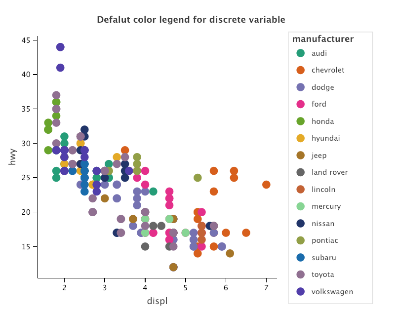
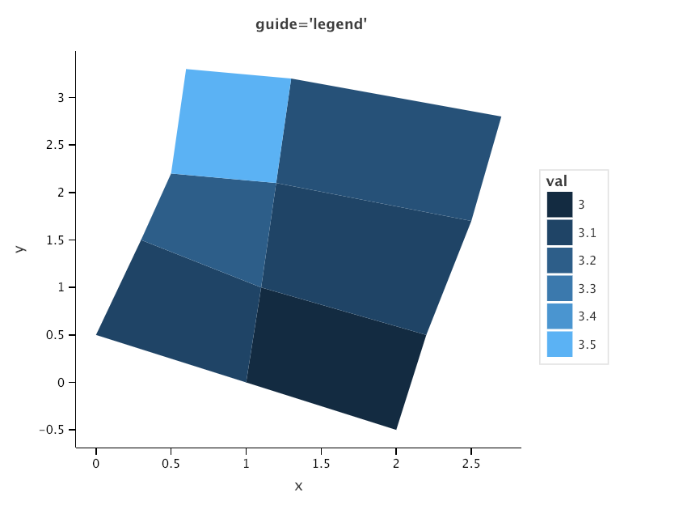
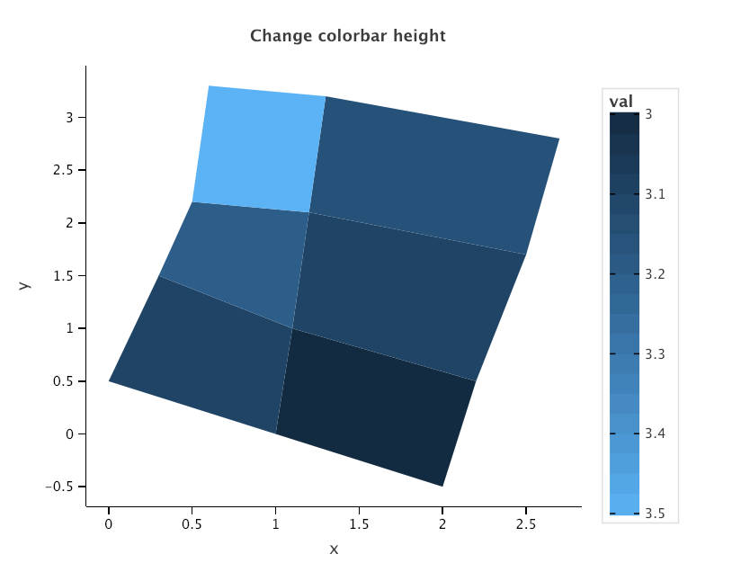
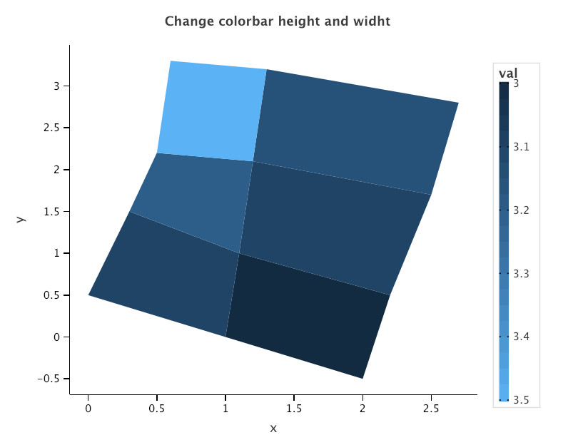

# Guides

Legend help users interpret the plot. 

### `guide_legend()`

Legend guide specification. 
Legend type guide shows key (i.e., geoms) mapped onto dataset values.

`guide_legend(nrow=None, ncol=None, byrow=None)`

##### Parameters

- `nrow` (int, optional): Number of rows in legend's guide
- `ncol` (int, optional): Number of columns in legend's guide
- `byrow`(boolean, optional): Type of output: by row (default), or by column
    
##### Examples

`mpg_url = 'https://www.kaggle.com/uciml/autompg-dataset#auto-mpg.csv'
mpg = pd.read_csv (mpg_url)
mpg.head()`

`p = ggplot(mpg, aes(x='displ', y='hwy')) + geom_point(aes(color='manufacturer'), size=5) 
 p`
 

`p + scale_color_discrete(guide=guide_legend(ncol=2))`

`p + scale_color_discrete(guide=guide_legend(ncol=2, byrow=True))`

`p + scale_color_discrete(guide=guide_legend(nrow=5)) + theme(legend_position='bottom')`

### `guide_colorbar()`

`guide_colorbar(barwidth=None, barheight=None, nbin=None)`

Continuous color bar guide. Color bar guide shows continuous color scales mapped onto values.
Color bar is available with scale_fill and scale_color.

##### Arguments
 
- `barwidth` (value, optional): Color bar width
- `barheight` (value, optional): Color bar height
- `nbin` int, optional): Number of bins in color bar
   
##### Examples

`id = ["a", "b", "c", "d", "e", "f"]
 val = [3, 3.1, 3.1, 3.2, 3.15, 3.5]
 x = [2, 1, 1.1, 2.2, 1, 0, 0.3, 1.1, 2.2, 1.1, 1.2, 2.5, 1.1, 0.3, 0.5, 1.2, 2.5, 1.2, 1.3, 2.7, 1.2, 0.5, 0.6, 1.3]
 y = [-0.5, 0, 1, 0.5, 0, 0.5, 1.5, 1, 0.5, 1, 2.1, 1.7, 1, 1.5, 2.2, 2.1, 1.7, 2.1, 3.2, 2.8, 2.1, 2.2, 3.3, 3.2]
 id4 = [v for v in id for _ in range(4)]
 val4 = [v for v in val for _ in range(4)]
 dat = dict(id=id4, val=val4, x=x, y=y)`
 
`p = ggplot(dat, aes('x', 'y'))
 p += geom_polygon(aes(fill='val', group='id'))
 p` 
 

`p + scale_fill_continuous(guide='legend')`

 
`p + scale_fill_continuous(guide=guide_colorbar(nbin=6))`

`p + scale_fill_continuous(guide=guide_colorbar(barheight=300))`

`p + scale_fill_continuous(guide=guide_colorbar(barheight=300, barwidth=10))`

