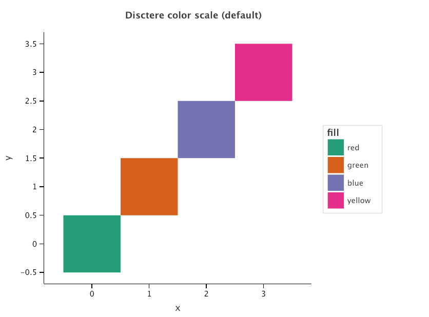
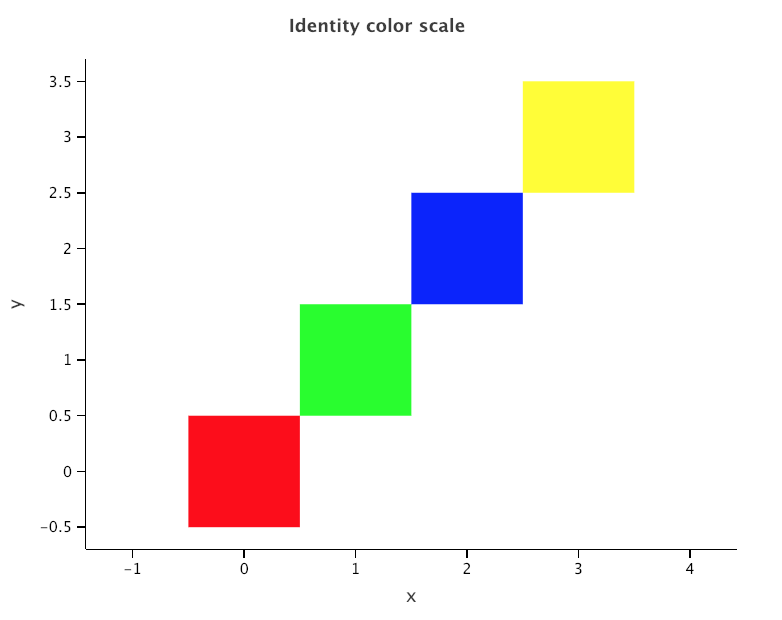

- `scale_alpha()` | Alpha transparency scale
- `scale_color_brewer(), scale_fill_brewer()` | Sequential, diverging and qualitative colour scales from colorbrewer.org
- `scale_color_continuous(), scale_fill_continuous()` | Continuous colour scales
- `scale_color_discrete(), scale_fill_discrete()` | Discrete colour scales
- `scale_color_gradient(), scale_fill_gradient(), scale_color_gradient2(), scale_fill_gradient2()` | Gradient colour scales
- `scale_color_identity(), scale_fill_identity(), scale_alpha_identity(), scale_linetype_identity(), scale_shape_identity(), scale_size_identity()` | Use values without scaling
- `scale_color_manual(), scale_fill_manual(), scale_alpha_manual(), scale_linetype_manual(), scale_shape_manual(), scale_size_manual()` | Create your own discrete scale
- `scale_color_grey(), scale_fill_grey()` | Sequential grey colour scales
- `scale_fill_hue(), scale_color_hue()` | Evenly spaced colours for discrete data
- `scale_shape()` | Scales for shapes, aka glyphs
- `scale_size(), scale_size_area()` | Scales for area
- `scale_x_continuous(), scale_y_continuous(), scale_x_log10(), scale_y_log10()` | Position scales for continuous data (x & y)
- `scale_x_datetime(),scale_y_datetime` | Position scales for date/time data
- `scale_x_discrete(), scale_y_discrete()` | Position scales for discrete data
- `ggtitle(), xlab(), ylab(), labs()` | Modify axis, legend, and plot labels
- `xlim(), ylim(), lims()` | Set scale limits

Aesthetics affected:

- `x` - x position (some geoms also have other aesthetics representing x positions, such as "xend" or "xmin")
- `y` - y position (some geoms also have other aesthetics representing y positions, such as "yend" or "ymin")
- `size` - size of a geom
- `shape` - shape of a geom
- `linetype` - type of a geom's outline (e.g., dashed, dotted)
- `colour` - color of a geom's outline
- `fill` - color of a geom's fill
- `alpha` - transparency of a geom (0=transparent ... 1=opaque)

# General purpose scales
Use them with any aesthetic: alpha, color, fill, linetype, etc. 
* `scale_*_identity()` - use data values as visual values (without transformation)
* `scale_*_manual` - map discrete values to manually chosen visual values (specify which visual values to map with)

### scale_*_identity

Use these scales when your data has already been scaled -i.e. it already represents aesthetic values that ggplot2 can handle directly. 

`scale_colour_identity(..., guide = "none")`

Input data expected: list of strings containing
- names of colors (i.e. 'green')
- hex codes of colors (i.e 'x00ff00')
- css colors (i.e 'rgb(0,255,0)')
 
 `scale_fill_identity(..., guide = "none")`
 
Input data expected: list of strings containing
- names of colors (i.e. 'green')
- hex codes of colors (i.e 'x00ff00')
- css colors (i.e 'rgb(0,255,0)')

 
 `scale_shape_identity(..., guide = "none")`
 
Input data expected: numeric code of shape. 
 
`scale_linetype_identity(..., guide = "none")`

Input data expected: numetic codes/names of line types ('dotdash')
0 = blank, 1 = solid, 2 = dashed, 3 = dotted, 4 = dotdash, 5 = longdash, 6 = twodash
 
 `scale_alpha_identity(..., guide = "none")`
 
Input data expected: numetic values in range [0..1] 
 
 `scale_size_identity(..., guide = "none")`
 
Input data expected: positive numetic values to set size.  

##### Arguments

- `name` (string): The name of the scale - used as the axis label or the legend title
- `breaks` (list of numerics): A numeric vector of positions (of ticks)
- `labels` (list of strings): A vector of labels (on ticks)
- `limits` (list): Continuous scale: a numeric vector of length two providing limits of the scale.
        Discrete scale: a vector specifying the data range for the scale. and the default order of their display in guides.
- `expand`: A numeric vector of length two giving multiplicative and additive expansion constants.
- `guide`: Guide to use for this scale. Defaults to "none".

##### Examples

`x = np.arange(4)
 y = x
 c = ["red", "green", "blue", "yellow"]  # data to be presented 'as is'.`
 
`p = ggplot() + geom_tile(aes(x, y, fill=c))
 p + ggtitle('Disctere color scale (default)')`

 
`p + scale_fill_identity() + ggtitle('Identity color scale')` 

### Scale_*_manual 

Use these scales to manually set the mapping of data to aesthetic values. 

`scale_color_manual(values, name=None, breaks=None, labels=None, limits=None, expand=None, na_value=None,
                        guide=None)`
                        
`scale_fill_manual(values, name=None, breaks=None, labels=None, limits=None, expand=None, na_value=None,
                       guide=None)`
                       
`scale_shape_manual(values, name=None, breaks=None, labels=None, limits=None, expand=None, na_value=None,
                        guide=None)`                                             

##### Arguments
- `name` (string): The name of the scale - used as the axis label or the legend title
- `breaks` (list of numerics): A numeric vector of positions (of ticks)
- `labels` (list of strings): A vector of labels (on ticks)
- `limits` (list): Continuous scale: a numeric vector of length two providing limits of the scale.
        Discrete scale: a vector specifying the data range for the scale. and the default order of their display in guides.
- `expand`: A numeric vector of length two giving multiplicative and additive expansion constants.

##### Examples

///

# Colors

### `scale_*_gradient()`,  `scale_*gradient2()`

Smooth gradient between two colors for fill/color aesthetic. Use `scale_*_gradient()` for a low-high two-color gradient and `scale_*_gradient2` for a low-mid-high color gradient.

`scale_fill_gradient(low=None, high=None,
                         name=None, breaks=None, labels=None, limits=None, expand=None, na_value=None, guide=None,
                         trans=None, )`

`scale_color_gradient(low=None, high=None,
                          name=None, breaks=None, labels=None, limits=None, expand=None, na_value=None, guide=None,
                          trans=None)`

`scale_fill_gradient2(low=None, mid=None, high=None, midpoint=0,
                          name=None, breaks=None, labels=None, limits=None, expand=None, na_value=None, guide=None,
                          trans=None)`
                          
`scale_color_gradient2(low=None, mid=None, high=None, midpoint=0,
                           name=None, breaks=None, labels=None, limits=None, expand=None, na_value=None, guide=None,
                           trans=None)`
##### Arguments
- `low` (string): Color for low end of gradient
- `mid` (string): `scale_*_gradient2` argument. Color for mid point
- `high` (string): Color for high end of gradient
- `midpoint`: Middle point value
- `name` (string): The name of the scale - used as the axis label or the legend title
- `breaks` (list of numerics): A numeric vector of positions (of ticks)
- `labels` (list of strings): A vector of labels (on ticks)
- `limits` (list): Continuous scale: a numeric vector of length two providing limits of the scale.
        Discrete scale: a vector specifying the data range for the scale. and the default order of their display in guides.
- `expand`: A numeric vector of length two giving multiplicative and additive expansion constants.                           
                                                     
##### Examples
`dat = {'x': [v for v in range(-16, 16)]}
 p = ggplot(dat)
 p += geom_tile(aes('x', fill='x'), width=1.05, height=10)`
 
`p + scale_fill_gradient(low='blue', high='red')` 

`p + scale_fill_gradient2(low='blue', mid='white', high='red', midpoint=7)`

### scale_*_brewer()

Sequential, diverging and qualitative color scales from colorbrewer.org for fill aesthetic. Color schemes provided
    are particularly suited to display discrete values (levels of factors) on a map.
    
`scale_fill_brewer(type=None, palette=None, direction=None,
                       name=None, breaks=None, labels=None, limits=None, expand=None, na_value=None, guide=None,
                       trans=None)`
                       
`scale_color_brewer(type=None, palette=None, direction=None,
                        name=None, breaks=None, labels=None, limits=None, expand=None, na_value=None, guide=None,
                        trans=None)`
                        
##### Palettes
- Diverging: BrBG, PiYG, PRGn, PuOr, RdBu, RdGy, RdYlBu, RdYlGn, Spectral
- Qualitative:Accent, Dark2, Paired, Pastel1, Pastel2, Set1, Set2, Set3
- Sequential: Blues, BuGn, BuPu, GnBu, Greens, Greys, Oranges, OrRd, PuBu,
        PuBuGn, PuRd, Purples, RdPu, Reds, YlGn, YlGnBu, YlOrBr, YlOrRd 
        
##### Arguments
- `type` (string): One of seq (sequential), div (diverging) or qual (qualitative) types of scales.
- `palette` (string or number): If a string, will use that named palette. If a number, will index into the list of palettes of appropriate type.
- `direction` (numeric): Sets the order of colors in the scale. If 1, the default, colors are as output by brewer.pal.
          If -1, the order of colors is reversed.
- `name` (string): The name of the scale - used as the axis label or the legend title
- `breaks` (list of numerics): A numeric vector of positions (of ticks)
- `labels` (list of strings): A vector of labels (on ticks)
- `limits` (list): Continuous scale: a numeric vector of length two providing limits of the scale.
        Discrete scale: a vector specifying the data range for the scale. and the default order of their display in guides.
- `expand`: A numeric vector of length two giving multiplicative and additive expansion constants.

##### Examples      

`dat = {'x': [v for v in range(-16, 16)]}
 p = ggplot(dat)
 p += geom_tile(aes('x', fill='x'), width=1.05, height=10)`  

`p + scale_fill_brewer()`

 
`p + scale_fill_brewer(direction=-1)`

`p + scale_fill_brewer(type='div')`

`p + scale_fill_brewer(type='qual', palette='Paired')`  

### scale_*_hue

Qualitative color scale with evenly spaced hues for color/fill aesthetic

`scale_fill_hue(h=None, c=None, l=None, h_start=None, direction=None,
                    name=None, breaks=None, labels=None, limits=None, expand=None, na_value=None, guide=None,
                    trans=None)`
                    
`scale_color_hue(h=None, c=None, l=None, h_start=None, direction=None,
                     name=None, breaks=None, labels=None, limits=None, expand=None, na_value=None, guide=None,
                     trans=None)`
                     
##### Arguments
- `h` (list of two numerics): Range of hues, in [0,360]
- `c` (numeric): Chroma (intensity of color), maximum value varies depending on.
- `l` (numeric): Luminance (lightness), in [0,100]
- `direction` (numeric):Direction to travel around the color wheel, 1 = clockwise (default), -1=counter-clockwise                     
- `name` (string): The name of the scale - used as the axis label or the legend title
- `breaks` (list of numerics): A numeric vector of positions (of ticks)
- `labels` (list of strings): A vector of labels (on ticks)
- `limits` (list): Continuous scale: a numeric vector of length two providing limits of the scale.
        Discrete scale: a vector specifying the data range for the scale. and the default order of their display in guides.
- `expand`: A numeric vector of length two giving multiplicative and additive expansion constants.

##### Examples

`dat = {'x': [v for v in range(-16, 16)]}
 p = ggplot(dat)
 p += geom_tile(aes('x', fill='x'), width=1.05, height=10)`
 
`p + scale_fill_hue()` 

`p + scale_fill_hue(c=20)`

### scale_*_grey()

Sequential grey color scale for color/fill aesthetic

`scale_fill_grey(start=None, end=None, direction=None,
                     name=None, breaks=None, labels=None, limits=None, expand=None, na_value=None, guide=None,
                     trans=None)`
                     
`scale_color_grey(start=None, end=None, direction=None,
                      name=None, breaks=None, labels=None, limits=None, expand=None, na_value=None, guide=None,
                      trans=None)` 
                                                                 
##### Arguments
- `start` (numeric): Gray value at low end of palette in range (0,100)
- `end` (numeric): Gray value at high end of palette in range (0,100)                                          
- `name` (string): The name of the scale - used as the axis label or the legend title
- `breaks` (list of numerics): A numeric vector of positions (of ticks)
- `labels` (list of strings): A vector of labels (on ticks)
- `limits` (list): Continuous scale: a numeric vector of length two providing limits of the scale.
        Discrete scale: a vector specifying the data range for the scale. and the default order of their display in guides.
- `expand`: A numeric vector of length two giving multiplicative and additive expansion constants.

##### Examples

`dat = {'x': [v for v in range(-16, 16)]}
 p = ggplot(dat)
 p += geom_tile(aes('x', fill='x'), width=1.05, height=10)`   

`p + scale_fill_grey()` 

 
`p + scale_fill_grey(start=100, end=0)`

# X/Y location scales

### `scale_x_continuous(), scale_y_continuous(), scale_x_log10(), scale_y_log10()` 

Position scales for continuous data (x & y). For logarithmical data, adjusts axes to represent logarithmical values. 

`scale_x_continuous(name=None, breaks=None, labels=None, limits=None, expand=None, na_value=None, trans=None)`

`scale_y_continuous(name=None, breaks=None, labels=None, limits=None, expand=None, na_value=None, trans=None)`

`scale_x_log10(name=None, breaks=None, labels=None, limits=None, expand=None, na_value=None)`

`scale_y_log10(name=None, breaks=None, labels=None, limits=None, expand=None, na_value=None)`

##### Arguments
- `name` (string): The name of the scale - used as the axis label or the legend title. If None, the default, the name of the scale
        is taken from the first mapping used for that aesthetic.
- `breaks` (list of numerics): A numeric vector of positions (of ticks)
- `labels` (list of strings): A vector of labels (on ticks)
- `limits` (list of numerics):  A numeric vector of length two providing limits of the scale.
- `expand` (list of numerics): A numeric vector of length two giving multiplicative and additive expansion constants.
- `na_value`: Missing values will be replaced with this value.
- `trans` (string): Name of built-in transformation. ('identity', 'log10')

##### Examples

`N = 21
 x = [v for v in range(N)]
 y0 = [pow(10, v / 10.) for v in range(N)]
 y1 = [v * 5 for v in range(N)]
 formula = ['10^(x/10)'] * N + ['5*x'] * N
 data = dict(x=x * 2, y=y0 + y1, formula=formula)`
 
`p = ggplot(data) + geom_point(aes('x', 'y', color='formula', size='formula')) + \
         scale_size_manual(values=[7, 3])`

`p + scale_y_log10()` 

`p + scale_y_log10() + scale_x_log10()`

### `scale_x_datetime(),scale_y_datetime`

Position scales for date/time data. Automatically set when one of the variables uses dates or times data format.

`scale_x_datetime(name=None, breaks=None, labels=None, limits=None, expand=None, na_value=None)`

`scale_y_datetime(name=None, breaks=None, labels=None, limits=None, expand=None, na_value=None)`

##### Arguments
- `name` (string): The name of the scale - used as the axis label or the legend title. If None, the default, the name of the scale
        is taken from the first mapping used for that aesthetic.
- `breaks` (list of numerics): A numeric vector of positions (of ticks)
- `labels` (list of strings): A vector of labels (on ticks)
- `limits` (list of numerics):  A numeric vector of length two providing limits of the scale.
- `expand` (list of numerics): A numeric vector of length two giving multiplicative and additive expansion constants.
- `na_value`: Missing values will be replaced with this value.

##### Examples 

`from datetime import datetime, timezone`

`N = 30
 days = [datetime(2017, 4, d+1, tzinfo=timezone.utc).timestamp()*1000 for d in range(N)]
 data= dict(days=days, val=[v for v in np.random.normal(0, 1, N)])
 ggplot(data)+geom_line(aes(x='days',y='val'))+\
         scale_x_datetime()`
         

         
`N = 1000
 seconds = [datetime(2017, 4,1, 12,int(s / 60), s % 60, tzinfo=timezone.utc).timestamp()*1000 for s in range(N)]
 data= dict(seconds=seconds, val=[v for v in np.random.normal(0, 10, N)])
 ggplot(data)+geom_line(aes(x='seconds',y='val'))+\
         scale_x_datetime('Time (min)')`    

###`scale_x_discrete(), scale_y_discrete()` 

Position scales for discrete data (x & y).

##### Arguments
- `name` (string): The name of the scale - used as the axis label or the legend title. If None, the default, the name of the scale
        is taken from the first mapping used for that aesthetic.
- `breaks` (list of numerics): A numeric vector of positions (of ticks)
- `labels` (list of strings): A vector of labels (on ticks)
- `limits` (list of numerics):  A numeric vector of length two providing limits of the scale.
- `expand` (list of numerics): A numeric vector of length two giving multiplicative and additive expansion constants.
- `na_value`: Missing values will be replaced with this value.

# scale_alpha()

Adjust transparency levels. 

`scale_alpha(range=None, name=None, breaks=None, labels=None, limits=None, expand=None, na_value=None,
                 guide=None, trans=None)`

##### Arguments
- `name` (string): The name of the scale - used as the axis label or the legend title. If None, the default, the name of the scale
        is taken from the first mapping used for that aesthetic.
- `breaks` (list of numerics): A numeric vector of positions (of ticks)
- `labels` (list of strings): A vector of labels (on ticks)
- `limits` (list of numerics):  A numeric vector of length two providing limits of the scale.
- `expand` (list of numerics): A numeric vector of length two giving multiplicative and additive expansion constants.
- `na_value`: Missing values will be replaced with this value.
- `range` (list of numerics of length 2): The range of the mapped aesthetics result.
 
##### Examples

!!! 
 
### scale_size()

Adjust area size. 

`scale_size(range=None, name=None, breaks=None, labels=None, limits=None, expand=None, na_value=None,
               guide=None, trans=None)`

##### Arguments
- `name` (string): The name of the scale - used as the axis label or the legend title. If None, the default, the name of the scale
        is taken from the first mapping used for that aesthetic.
- `breaks` (list of numerics): A numeric vector of positions (of ticks)
- `labels` (list of strings): A vector of labels (on ticks)
- `limits` (list of numerics):  A numeric vector of length two providing limits of the scale.
- `expand` (list of numerics): A numeric vector of length two giving multiplicative and additive expansion constants.
- `na_value`: Missing values will be replaced with this value.
- `range` (list of numerics of length 2): The range of the mapped aesthetics result.
        
##### Examples 

!!!
               
### scale_size_area()

Adjust area size. This geom precisely maps the value of 0 to the size of 0. 

`scale_size_area(max_size=None, name=None, breaks=None, labels=None, limits=None, expand=None, na_value=None,
                     guide=None, trans=None)`
                     
##### Arguments
- `name` (string): The name of the scale - used as the axis label or the legend title. If None, the default, the name of the scale
        is taken from the first mapping used for that aesthetic.
- `breaks` (list of numerics): A numeric vector of positions (of ticks)
- `labels` (list of strings): A vector of labels (on ticks)
- `limits` (list of numerics):  A numeric vector of length two providing limits of the scale.
- `expand` (list of numerics): A numeric vector of length two giving multiplicative and additive expansion constants.
- `na_value`: Missing values will be replaced with this value.
- `max_size` (numeric): The max size that is mapped to.

##### Examples

!!!

# Shape

### scale_shape() 
Plot data points as various shapes. Select shape code from the reference. Note that continuous data cannot be mapped to shape. 

`scale_shape(solid=True, name=None, breaks=None, labels=None, limits=None, expand=None, na_value=None, guide=None)`

##### Arguments

- `solid` (boolean): Are the shapes solid (True, default), or hollow (False)?
- `name` (string): The name of the scale - used as the axis label or the legend title 
- `breaks` (list of numerics): A numeric vector of positions (of ticks)
- `labels` (list of strings): A vector of labels (on ticks)
- `limits` (list): Continuous scale: a numeric vector of length two providing limits of the scale.
 Discrete scale: a vector specifying the data range for the scale. and the default order of their display in guides.
- `expand`:A numeric vector of length two giving multiplicative and additive expansion constants.

##### ! Examples

`p = ggplot(dat, aes('x', 'y', group='cat'))
p += geom_line(size=0.1)
p += scale_shape(solid=True)
p`

# Limits

### `lims()`, `xlim()`, `ylim()`
Set axes limits by changing scales' `limits` argument or use shortcut functions `lims()` or `xlim()`, `ylim()`
By default, any values outside the limits will be replaced with NA.

`lims(...)`

`xlim(...)`

`ylim(...)`

##### Arguments

- for continuous data: range limits
- for discrete data: lists of strings, limit values to include/exclude

##### Examples 

Continuous data

`N = 100
 data = dict(x=np.random.normal(0, 10, N), y=np.random.normal(10, 3, N))`
 
`p = ggplot(data) + geom_point(color='light_blue', size=10)
 p + scale_x_continuous(limits=[-100, 100])`
 

 
`p + scale_x_continuous(limits=[-10, 10], expand=[0, 10]) + geom_vline(aes(xintercept=[-10, 10]))`

`p + xlim(-10, 10) + ylim(6, 12)` 
or
`p + lims([-10, 10], [6, 12])` 

Discrete data 

`p = ggplot(mpg) + geom_point(aes(x='manufacturer', y='hwy'))`

`jp_brands = ['honda', 'nissan', 'subaru', 'toyota']
 p + scale_x_discrete(limits=jp_brands)`
 
`p + xlim(*jp_brands)`