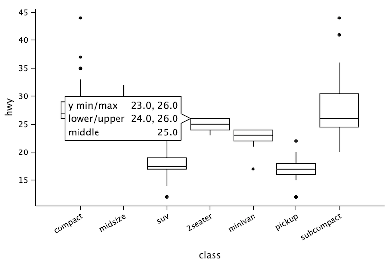

# Tooltip configuration


It is possible to customize the content of tooltips for the layer. The parameter `tooltips` of `geom` functions is responsible for this.

The following functions are used to set lines and define formatting in the tooltip:

`tooltips=layer_tooltips().line(...).format(...)`


### layer_tooltips().line(...)
Specifies the string template to use in the multi-line tooltip. The presence of `line()` overrides the default tooltip.

Variables and aesthetics can be accessed via a special syntax:
- `$color` for aesthetic;
- `$var@year` for variable;
- `${var@number of cylinders}` for variable with spaces in the name.

A dollar sign can be escaped with a backslash: `\$text` to get the string `"$text"`.


#### Labels configuration
The default tooltip has a label before the value, usually containing the name of the mapped variable.
It has it's own behaviour, like blank label for axis aesthetics. 
This default label can be set in template using a pair of symbols `@|`.
The label is overridden by specifying a string value before `|` symbol.

Within the tooltip line the label is aligned to the left, the string formed by template is aligned to the right.
If a label is not specified, the string will be centered in the tooltip. For example:


- `line('$color')`: no label, value is centered;
- `line('|$color')`: label is empty, value is right-aligned;
- `line('@|$color')`: default label is used, value is right-aligned;
- `line('my label|$color')`: label is specified, value is right-aligned.


### layer_tooltips().format(...)
Defines the format for displaying the value.
The format will be applied to the mapped value in the default tooltip or to the corresponding value specified in the `line` template.

##### Arguments

- `field` (string): The name of variable/aesthetic.
- `format` (string): The format to apply to the field. 
The format contains a number format (`1.f`) or a string template (`{.1f}`).
The numeric format for non-numeric value will be ignored.

The string template in format will allow to change lines for the default tooltip without `line` specifying.

If you need to include a brace character in the literal text, it can be escaped by doubling: {{ and }}, e.g.,
- `text` -> `"text"`
- `{{text}}` -> `"{text}"`
- `$var@model` -> `"mustang"`
- `{{$var@model}}` -> `"{mustang}"`

Variable's and aesthetic's formats are not interchangeable, i.e. var format will not be applied to aes, mapped to this variable.

    
### Examples

```
p = ggplot(mpg, aes(x='displ', y='hwy', color='manufacturer')) + theme(legend_position='none') 

p + geom_point(size=5, tooltips=layer_tooltips()\
                                    .format('var@cty', '.1f')
                                    .format('var@hwy', '.1f')
                                    .line('$var@manufacturer $var@model')
                                    .line('cty/hwy|$var@cty/$var@hwy')
                                    .line('@|$var@class')
                                    .line('year|$var@year'))
```


Change format for the default tooltip:

`p + geom_point(size=5, tooltips=layer_tooltips().format('color', 'it is {}'))`


## Outlier tooltips configuration

The default outlier's tooltip contain a string like `“name: value”`: there is no label and no alignment. 
It's possible to change formatting of it with `format` function. The number format (`'1.f'` ) leaves 
the string as is (`“name: value”`) and formats the value. The string template replaces the default string:
`‘{.1f}` - with `“value”`,  `‘format text {.1f}’` - with `“format text value”`.

The specified `line` for outlier will move it to the general multi-line tooltip.
   
    
### Examples

`p2 = ggplot(mpg, aes('class','hwy', color='class')) + theme(legend_position='none')` 
          
          
Change formatting for outliers:
```
p2 + geom_boxplot(tooltips=layer_tooltips()
                        .format('$Y', '.2f')          # all positionals
                        .format('ymax' , '.3f')       # use number format --> "ymax: value"
                        .format('middle' , '{.3f}')   # use line format --> "value"
                        .format('ymin' , 'ymin is {.3f}'))
```                        


                  
Move outliers to the general tooltip:

`p2 + geom_boxplot(tooltips=layer_tooltips().line('lower/upper|$lower, $upper'))`

                 


  
## Hiding tooltips     
Set `tooltips = "none"` to hide tooltips from the layer.
          

## Corner tooltips
The multi-line tooltip can be placed in the corner. 
The parameter `tooltip_anchor` of `theme` specifies the corner of the plot to place tooltip:
- 'top_right' 
- 'top_left' 
- 'bottom_right' 
- 'bottom_left'
 
### Example
```
 ggplot(iris_df) + theme(legend_position='none', tooltip_anchor='top_right')\
 + geom_area(aes(x='sepal_length', color='sepal_width', fill='species'), stat='density',\
     tooltips=layer_tooltips()
                 .line('$fill')
                 .line('length|$x')
                 .line('density|$y'))
```                 
 