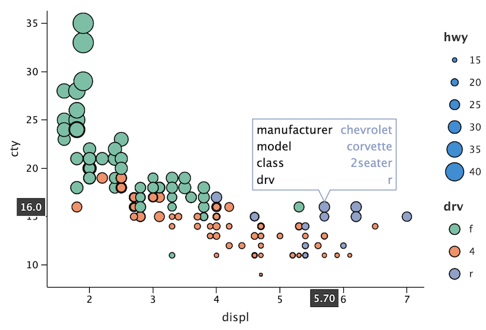
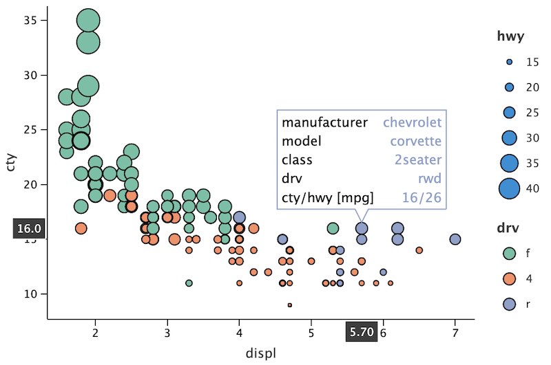

# Tooltip Customization

> **NOTE**
>
> This document only contains description of the new features in Lets-Plot v2.0.3:
> - *Tooltip `variables` parameter*
> 
> The full doc you can find here: [Tooltip Customization](https://lets-plot.org/pages/features/tooltips.html?highlight=tooltip)
>

- [Tooltip `variables` parameter](#variables)
  - [Examples](#example-variables)    
    
------


The following functions set lines, define formatting of the tooltip, its location and width:
```
tooltips=layer_tooltips(variables)
    .format(field, format)
    .line(template)
    .anchor(position)
    .min_width(value)
```

<a id="variables"></a>
### Tooltip `variables` parameter: `layer_tooltips(variables = ['varName1', ... , 'varNameN'] )`
The `variables` parameter defines a list of variable names, which values will be placed line by line in the general tooltip.
If formatting is specified for a variable from this list (with the `format` function), it will be applied.
Otherwise, the default formatting is used. 
Additional tooltip lines can be specified using the `line` functions.


<a id="example-variables"></a>
### Examples

Set list of variables to place them in a multiline tooltip with the default formatting:

```
ggplot(mpg) + geom_point(aes(x='displ', y='cty', fill='drv', size='hwy'), shape=21, color='black',
                         tooltips=layer_tooltips(['manufacturer', 'model', 'class', 'drv']))
```



Define the format for the variable from the list and specify an additional line:
```
ggplot(mpg) + geom_point(aes(x='displ', y='cty', fill='drv', size='hwy'), shape=21, color='black',
                         tooltips=layer_tooltips(['manufacturer', 'model', 'class', 'drv'])
                                       .format('drv', '{}wd')
                                       .line('cty/hwy [mpg]|@cty/@hwy'))
```


